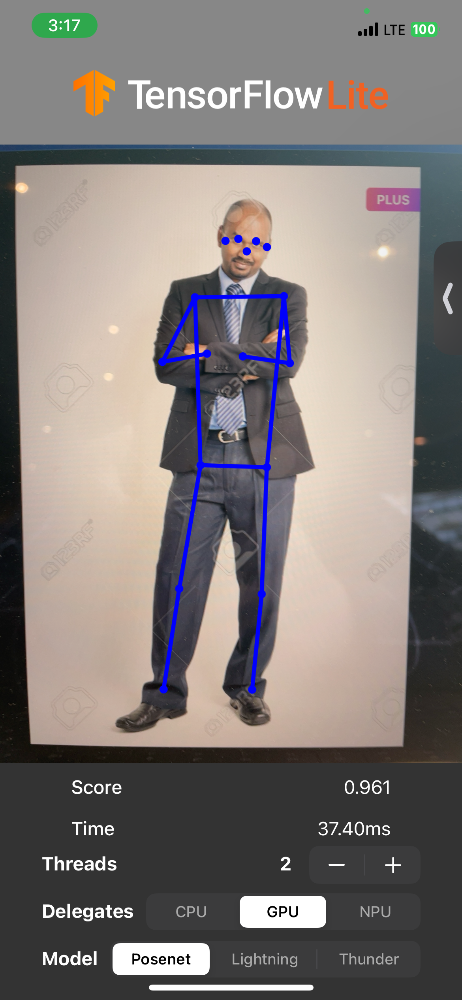
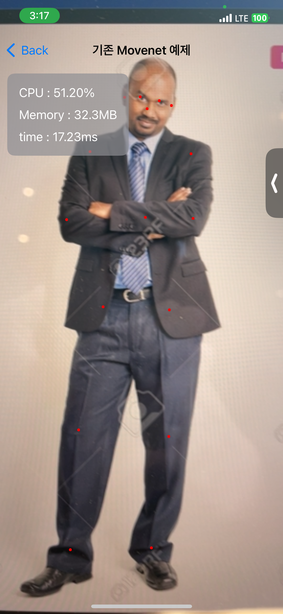
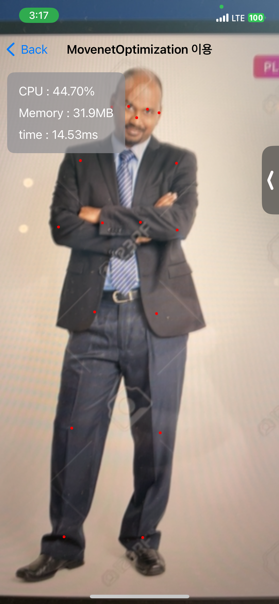

# MovenetOptimization

MovenetOptimization은 TensorFlow에서 제공하는 [Movenet pose_estimation 모델](https://www.tensorflow.org/lite/examples/pose_estimation/overview)을 iOS 환경에서 최적화하여 보다 나은 성능과 품질을 제공하기 위한 프로젝트입니다. Movenet은 인체의 주요 관절 위치를 추정하는 강력한 모델이지만, iOS 환경에서 기본 예제를 빌드하면 화질 저하 및 기대에 미치지 못하는 처리 속도가 발생할 수 있습니다. 이러한 문제를 해결하기 위해 MovenetOptimization에서는 사전처리 과정을 개선하여 처리 속도를 향상시키고 모델의 정확성을 유지하는 것을 목표로 하고 있습니다.

## 프로젝트 구성

### MovenetOptimization

Movenet 모델을 최적화하여 iOS에서 효율적으로 동작할 수 있도록 다양한 기능을 제공합니다. 주로 preprocessing(사전 처리), inference(추론), postprocessing(후처리) 등의 핵심 로직이 구현되어 있습니다.

* MovenetEngine: 모델 추론 엔진으로, 입력된 영상 데이터를 사전 처리한 후 추론을 수행하고 결과를 후처리하여 반환합니다.
* OpenCV 사전처리: 영상 데이터를 OpenCV를 통해 최적화하여 처리 속도를 높이는 기능이 포함되어 있습니다.

### MovenetOptimizationTests

MovenetOptimization의 **사전 처리 기능의 성능 비교**를 위한 유닛 테스트 코드를 포함합니다.

### MovenetOptimizationExample

MovenetOptimization의 기능을 **SwiftUI**를 사용하여 만든 예제 프로젝트입니다.

## 처리속도 개선 방법

### 카메라 영상의 사전 처리
입력된 영상 데이터를 모델에 직접 전달하는 대신, 사전 처리 과정을 통해 영상의 크기를 조절하여 모델의 처리속도를 높입니다.

#### 기존 MoveNet Example

기존 처리 시간을 보면 37.40ms가 나옵니다.
> 💡 **처리 시간**의 기준은 **preprocessing(사전처리)**, **inference(추론)**, **postprocessing(후처리)** 시간을 합친 시간입니다.

#### 영상 사전처리 설정

iOS내에서 영상 사전처리 후에 치리시간을 보면은 17~20ms 나옵니다. 
간단한 영상 작업만으로도 같은 AI 모델에서 처리 시간이 **2배 이상**으로 좋아지는걸 확인 할 수 있었습니다.

### OpenCV를 통한 최적화
OpenCV 라이브러리를 사용하여 사전 처리 단계에서의 최적화를 수행합니다. 
추가로 RGB 값을 최적화하여 모델의 처리 속도를 높입니다.

OpenCV를 통해 처리한 결과를 보면 처리시간은 13 ~ 15ms 정도로 4ms 개선되는걸 볼 수 있습니다. 또한 CPU 사용량도 47 ~ 50%에서 43~45% 정도로 개선되는걸 볼 수 있습니다.
테스트를 통해 사전처리 성능을 체크해 보면 아리처럼 결과를 볼 수 있습니다.

#### 기존 영상 사전처리
* 평균 실행 시간: 0.015초
* 상대 표준 편차: 39.479%

#### OpenCV를 통한 사전처리
* 평균 실행 시간: 0.004초
* 상대 표준 편차: 63.394%

OpenCV를 통해 사전처리를 해봤을때 평균 실행 시간은 0.015초에서 0.004초로 **4배 가량 개선** 되었습니다.

## 라이선스

이 프로젝트는 Apache 2.0 License로 라이선스가 부여되어 있습니다.